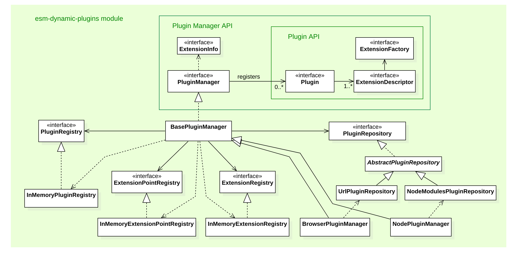

# esm-dynamic-plugins
[](https://github.com/flowscripter/esm-dynamic-plugins/blob/master/LICENSE.md)
[](https://david-dm.org/flowscripter/esm-dynamic-plugins)
[](https://travis-ci.com/flowscripter/esm-dynamic-plugins)
[](https://sonarcloud.io/dashboard?id=flowscripter_esm-dynamic-plugins)
[](https://www.npmjs.com/package/@flowscripter/esm-dynamic-plugins)

> Plugin framework using ES Modules and Dynamic Import.

## Overview

This project provides a Javascript framework for developing, deploying and installing plugins which may be dynamically 
discovered and imported into a running Javascript process. 

#### Key Features 

* Universal support for both NodeJS and browser Javascript runtimes
* Dynamic plugin import using [Javascript dynamic import](https://github.com/tc39/proposal-dynamic-import)
* ES2015 module based
* Written in Typescript

#### Key Concepts

The framework's key concepts are borrowed from the Eclipse Project's extension framework. The key concepts are:
 
* A *HostApplication* instantiates a *PluginManager* 
* The *PluginManager* provides an *ExtensionPointRegister* 
* The *HostApplication* can declare *ExtensionPoints* in the *ExtensionPointRegister*
* A *Plugin* provides one or more *Extensions* for one or more *ExtensionPoints*
* A *Plugin* provides an *ExtensionDescriptor* for each *Extension* it provides
* A *PluginManager* scans for and registers *Plugins* which provide *Extensions* for the known *ExtensionPoints*
* A *HostApplication* uses the *PluginManager* to query for and select an *Extension* for a desired *ExtensionPoint*
* The *PluginManager* uses an *ExtensionFactory* declared in an *ExtensionDescriptor* to instantiate a selected *Extension* 

The following high level class diagram illustrates these relationships:


The following sequence diagram illustrates the key steps for a *HostApplication* to use a *PluginManager* for discovery and registration of *Plugins*: 


Once registration has been performed, the *HostApplication* may query for and instantiate *Extensions* for known *ExtensionPoints*:


As *ExtensionPoints* are simply Javascript classes, for the purposes of testing or validation, it is 
possible to bypass the framework altogether and import an *Extension* and use it directly:
 


## API

[API documentation](https://flowscripter.github.io/esm-dynamic-plugins)

## Development

Firstly: 

```
npm install
```

then:

Build: `npm run build`

Watch: `npm run watch`

Test: `npm test`

Lint: `npm run lint`

Docs: `npm run docs`

The following diagram provides an overview of the main classes:



## Further Details

#### Entry Points for Node and Browser

The build config in `rollup.config.js` produces two bundled entry points:
 
* `NodePluginManager.js` is intended for consumption in node and exposed via the `main` property in `package.json`.
* `BrowserPluginManager.js` - is intended for consumption in a browser and exposed via the `browser` property in `package.json`.

This ensures that dependencies for node specific modules can be shimmed via [rollup-plugin-node-builtins](https://github.com/calvinmetcalf/rollup-plugin-node-builtins)  

Note that the API used to both implement plugins and new `PluginManager` implementations only exists as Typescript type definitions
and these are exposed via the `types` property in `package.json`. As the API is pure Typescript interface there is no equivalent
to be exposed for Javascript.

#### No Legacy JavaScript Support

Please note, that this project makes no attempt to support legacy Javascript versions or runtimes. 
Browsers and NodeJS versions need to support:

* https://github.com/tc39/proposal-dynamic-import
* https://tc39.github.io/ecmascript-asyncawait/
* https://developer.mozilla.org/en-US/docs/Web/JavaScript/Reference/Functions/Arrow_functions

Because of this the project's exported module is configured so that:
 
* no transpiling is performed (apart from TypeScript to ES2015 JavaScript)
* `package.json` specifies:
    * `"main": "dist/index.js"`
    * `"type": "module"`
    * `"node": ">=10.15.1"` so that the `--experimental-modules` flag can be used

#### Configuration

Explanation of project configuration files:

* `.editorconfig` - Configures [EditorConfig](https://editorconfig.org) compliant editors.
* `.eslintrc.js` - TypeScript based [ESLint](https://eslint.org) configuration for the project derived from [@flowscripter/eslint-config](https://www.npmjs.com/package/@flowscripter/eslint-config).
* `.gitignore` - Specifies files for git to [ignore](https://git-scm.com/docs/gitignore). 
* `.huskyrc.js` - Provides git hooks using [Husky](https://github.com/typicode/husky) to enforce semantic commit messages and linting.   
* `.travis.yml` - Defines the [Travis](https://travis-ci.com) build pipeline.
* `commitlint.config.js` - Configures [commitlint](https://conventional-changelog.github.io/commitlint) to ensure commit messages can be used to drive automated [Semantic Version](https://semver.org) releases.
* `package.js` - Defines development cycle scripts and configures publication of ES2015 modules. 
* `release.config.js` - Configuration for automated semantic version releasing using [semantic-release](https://semantic-release.gitbook.io/semantic-release/)
* `renovate.json` - Ensures automated dependency upgrade via [Renovate](https://renovatebot.com) with configuration derived from [@flowscripter/renovate-config](https://www.npmjs.com/package/@flowscripter/renovate-config)
* `rollup.config.js` - Defines the TypeScript and ES2015 module build pipeline for [Rollup](https://rollupjs.org/guide/en)
* `tsconfig.json` - [TypeScript](https://www.typescriptlang.org) configuration for the project derived from [@flowscripter/tsconfig](https://www.npmjs.com/package/@flowscripter/tsconfig)

## License

MIT © Vectronic
