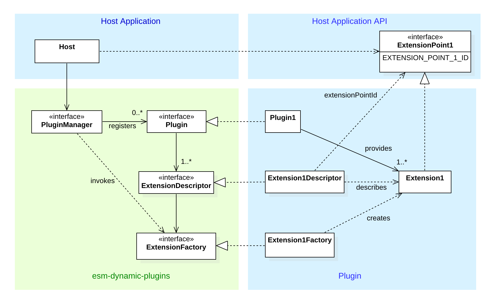

# esm-dynamic-plugins
[](https://github.com/flowscripter/esm-dynamic-plugins/blob/master/LICENSE.md)
[](https://david-dm.org/flowscripter/esm-dynamic-plugins)
[](https://travis-ci.com/flowscripter/esm-dynamic-plugins)
[](https://sonarcloud.io/dashboard?id=flowscripter_esm-dynamic-plugins)
[](https://www.npmjs.com/package/@flowscripter/esm-dynamic-plugins)

> Plugin framework using ES Modules and Dynamic Import.

## Overview

This project provides a Javascript framework for developing, deploying and installing plugins which may be dynamically 
discovered and imported into a running Javascript process. 

#### Key Features 

* Isomorphic support for both NodeJS and browser Javascript runtimes
* Implemented as a lightweight basic framework, with most functionality implemented as core plugins
* Pluggable implementations for deployment, installation and scanning of plugins 
* Dynamic plugin import implemented via [Javascript dynamic import](https://github.com/tc39/proposal-dynamic-import)
* ES2015 module based
* Written in Typescript

#### Key Concepts

The framework's key concepts are borrowed from the Eclipse Project's extension framework. The key concepts are:
 
* *ExtensionPoints* are defined by *Interfaces* available to a *HostApplication*
* A *Plugin* implements one or more *Extensions* for one or more *ExtensionPoints*
* A *HostApplication* uses a *PluginManager* to scan for and register available *Plugins*
* A *HostApplication* uses a *PluginManager* to query for and instantiate *ExtensionPoints*

The following high level class diagram illustrates these relationships:



The following sequence diagram illustrates the key steps for a *HostApplication* to use a *PluginManager* for both:

* static registration of known *Plugins* 
* scanning and dynamic registration of discovered *Plugins* 


Once scanning and registration have been performed, the *HostApplication* may query for and instantiate *Extensions* for known *ExtensionPoints*:

[Query and Instantiation Sequence Diagram](images/query_and_instantiation_sequence_diagram.png "Query and Instantiation Sequence Diagram")

For the purposes of testing or validation, as *ExtensionPoints* are simply Javascript classes it also 
possible to bypass the framework altogether and import an *Extension* and use it directly:
 
[Direct Instantiation Sequence Diagram](images/direct_instantiation_sequence_diagram.png "Direct Instantiation Sequence Diagram")

#### Core Plugins

#### NO LEGACY SUPPORT

Please note, that this project makes no attempt to support legacy Javascript versions or runtimes. 
Browsers and NodeJS versions need to support:

* https://github.com/tc39/proposal-dynamic-import
* https://tc39.github.io/ecmascript-asyncawait/
* https://developer.mozilla.org/en-US/docs/Web/JavaScript/Reference/Functions/Arrow_functions

Because of this the project's exported module is configured so that:
 
* no transpiling is performed (apart from TypeScript to ES2015 JavaScript)
* `package.json` specifies:
    * `"main": "dist/index.mjs"` (as per: https://nodejs.org/api/esm.html#esm_enabling and
https://github.com/nodejs/node-eps/blob/master/002-es-modules.md#44-shipping-both-esm-and-cjs)
    * `"module": "dist/index.mjs"` (as per: https://github.com/rollup/rollup/wiki/pkg.module)
    * `"node": ">=10.15.1"` so that the `--experimental-modules` flag can be used

## Installation

## Usage

## API

[API documentation](https://flowscripter.github.io/esm-dynamic-plugins)

## Development

Firstly: 

```
npm install
```

then:

Build: `npm run build`

Watch: `npm run watch`

Test: `npm test`

Lint: `npm run lint`

Docs: `npm run docs`

## License

MIT © Vectronic
